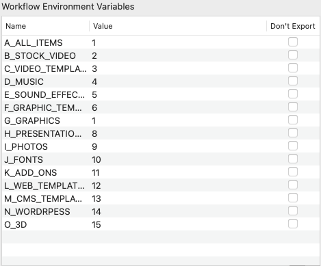

# Alfred Envato Elements Search Workflow

This workflow is an easy way to search items on Envato Elements.

## Environment Variables

1. Environment Variables are all searchable categories on Envato Elements.
2. The start word of the variables are just for sorting on the Workflow Environment Variables list
3. You can set the value to be the order. If the value is -1, it will not display on alfred search results.

## How to use it

You can type the keyword "ee" and press enter on alfred search input, it will visit Envato Elements.

You can type the keyword "ee" + space + "what you want to search" and press enter on alfred search input, it'll show all searchable categories which you can choose.

## Note

1. `searchable_list.rb` file is for people who want to learn how to write workflow (Script Filter), all of it are packaged inside the "Script Filter" in the workflow.

2. This is my first try to write a alfred workflow, if there is anything I can do better please let me know, thank you!

## Download

https://github.com/hellolucky/Alfred-Envato-Elements-Search-Workflow/releases/latest/download/Alfred.Envato.Elements.Search.alfredworkflow